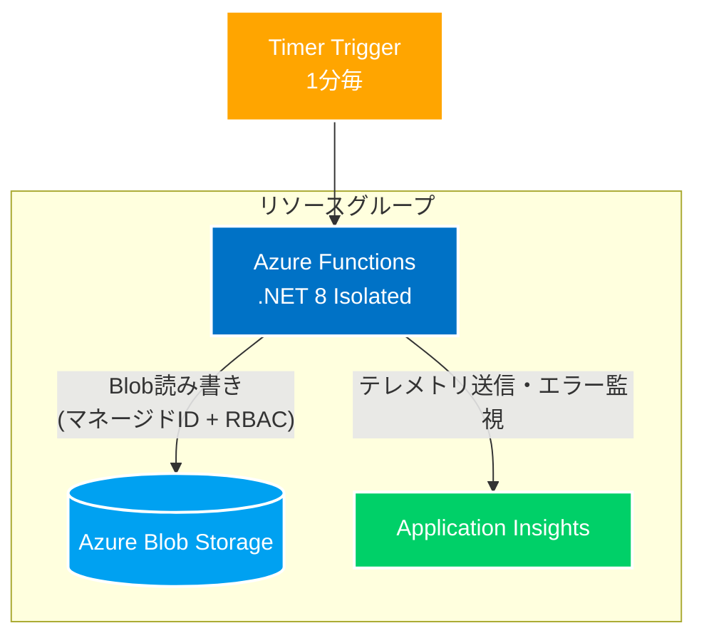

# 接続情報最小化のAzureログ自動化基盤

## 1. プロジェクト概要

本プロジェクトは、**接続文字列は最小限に抑えつつ、再現性のあるAzure上のログ生成自動化環境**を構築することを目的としています。

* **Azure Functions (.NET 8 Isolated)** を用いた定期実行（Timer Trigger）
* **Blob Storage へのログ出力**（マネージドIDによるセキュアな接続）
* **Application Insights / Log Analytics への監視と連携**
* **IaC (Bicep) による再現可能な環境管理**
* **最小権限の RBAC 設計**

この README では、**開発フェーズごとの課題と解決策**を整理し、未経験ながら Azure 環境で実務レベルの構築・運用を経験した流れを記載しております。

---

## 2. 構成図

---

## 3. 開発の過程
### フェーズ1：ローカル開発環境の構築

#### 1. 背景/やったこと

* .NET 8 Isolated モデルへの移行に伴い、VS Code上でローカル開発環境を構築
* VS Codeで直接クラウド上の検証用ストレージに接続し、リモートデバッグを実行
* ネットワークの遅延やRBAC反映の遅延など、実際のAzure環境で起こる挙動を体験

#### 2. 問題

* 従来の In-Process モデル用デバッグ設定では関数が認識されず、初回接続時にエラー
* デバッグできず、処理の検証が困難

#### 3. 解決策

* `tasks.json` のビルドターゲットを Isolated モデル向けに修正
* `launch.json` の `preLaunchTask` と整合性を調整

#### 4. 結果

* 初期段階から本番環境に近い状態での動作検証を体験
* ローカル → クラウドに移行した時のギャップを最小化

#### 5. 学び

* ローカルで確実に動作確認できないコードは、クラウドでも動かない
* 実際に開発する際のリスクを最初の段階で痛感

### フェーズ2：Azure プロトタイプ構築

#### 1. 背景/やったこと

* リソースグループ `RG-Portfolio-Automation` に、Azure Portalから Functions と Storage を作成
* 接続文字列による接続でプロトタイプを実装

#### 2. 問題

* 接続文字列をコードに書くとセキュリティ上のリスク
* GUI操作のみでは再現性が低く、原因特定が困難

#### 3. 解決策

* 「とりあえず動く状態」を作った後、以下を検討

  * フェーズ3：マネージドIDへの移行
  * フェーズ4：IaC（Bicep）への移行（再現性確保）

#### 4. 結果

* プロトタイプとして動作を確認
* 課題が明確になり、3.解決策に記載の通り設計方針の改善を決定

#### 5. 学び

* GUIだけでの環境構築では再現性・セキュリティが不十分
* 「動くこと」に加えて「安全に再現できること」の両立が必要

### フェーズ3：マネージドIDへの移行

#### 1. 背景/やったこと

* Function にシステム割り当てマネージドIDを付与
* Azure.Identity でセキュアな認証を実装

#### 2. 問題

* ID付与だけでは Storage にアクセスできず、何度やっても認証エラー（403 Forbidden）が発生
* RBAC の存在や権限反映のタイムラグでトラブル

#### 3. 解決策

* 必要な権限（ストレージBLOBデータ共同作成者）を特定
* 最小権限原則に基づき、IDを指定して権限を付与

#### 4. 結果

* マネージドIDにより Blob への読み書きは可能（ただし関数実行用のストレージ接続は必要）
* Function App の展開や Run From Package には AzureWebJobsStorage が必須であるため、完全なパスワードレスではない

#### 5. 学び

* Function App 展開用ストレージは AzureWebJobsStorage が必須
* RBAC の正しい理解なしではパスワードレス化は不可能
* Azure の権限設計と最小権限原則を実務で体感

### フェーズ4：IaC (Bicep) への移行

#### 1. 背景/やったこと

* Azure Portalからのリソース作成（手動）をやめ、Bicep ファイルで全体を管理
* Timer Trigger + Blob アクセス、App Insights、Log Analytics をコード化

#### 2. 問題

* デプロイ後に Timer Trigger が動作せず、関数が登録されない
* 原因は環境変数 `FUNCTIONS_EXTENSION_VERSION` と `FUNCTIONS_WORKER_RUNTIME` の指定漏れ
* RBACロールID指定ミスや listKeys 警告など Bicepのエラーに遭遇

#### 3. 解決策

* 必須環境変数を明示的に追加

  * `FUNCTIONS_EXTENSION_VERSION = '~4'`
  * `FUNCTIONS_WORKER_RUNTIME = 'dotnet-isolated'`
* subscriptionResourceId を指定したセキュアなロール指定

#### 4. 結果

* 再現可能なセキュアなインフラ環境を構築
* Timer Trigger + Blobへのアクセスが安定稼働

#### 5. 学び

* 小さな設定ミスで全体が停止することを痛感
* ドキュメント参照と再現テストによる自力トラブルシュートの難しさを痛感
* IaC + RBAC + Managed Identity の統合しての運用の必要性を痛感

### フェーズ5：BicepリファクタリングとCI/CD実装

#### 1. 背景/やったこと

* GitHub Actionsを利用したCI/CDパイプラインにおいて、インフラ（Bicep）とアプリケーション（.NET 8）の一括デプロイを実行
* Bicepコード内のストレージ接続文字列の取得ロジックを見直し、よりセキュアになるようリファクタリングを実施

#### 2. 問題

* `listKeys` の使用により `use-resource-symbol-reference` 警告が出て、GitHub Actionsがエラーとして検知しデプロイが中断
* 権限付与（RBAC）とアプリの設定更新が同時に走り、「DeploymentActive」エラーによるデプロイの渋滞が発生

#### 3. 解決策

* `listKeys` をリソース名から直接呼び出す形式に変更し、警告を解消
* 複雑な接続文字列の生成ロジックを `var` に切り出し、`appSettings` には完成した変数のみを渡す構造に改善

#### 4. 結果

* GitHub Actionsが正常に完走
* 実行順序が担保されたことで、リソースの競合エラーが発生しないインフラ構成を構築

#### 5. 学び

* 同じロジックでも、記述する場所によってツールの評価が変わるというBicepの思考を理解
* 複雑な設定を詰め込むのではなく、変数を活用して設定箇所をシンプルに保つことでデプロイのエラーが少なくなると理解

### フェーズ6：KQLによる監視

#### 1. 背景/やったこと
* Log Analytics ワークスペースに集約された `AppRequests` ログを対象に、KQLを用いたクエリ分析を実施
* 1時間単位でのログ集計を行い、関数の実行推移をグラフ化

#### 2. 問題
* Application InsightsとLog Analyticsではテーブル構造が異なり、標準的なカラム名（operation_Name等）ではエラーが発生
* 範囲を指定しない数値データのみでは、特定の時間帯の負荷や実行の成否を直感的に判断することが困難

#### 3. 解決策
* `TimeGenerated` や `AppRoleName` を用いたLAW専用のクエリへ最適化
* `bin(TimeGenerated, 1d)` を用いて、ログを日次単位で取得
* `render columnchart` を活用し、文字データを分かりやすいグラフへ変換

#### 4. 結果
* 任意の期間の実行回数グラフを生成し、負荷状況を判断できるよう実装
* 複雑なログ群から必要な情報を抽出し、グラフとして出力する一連の手法を実装

#### 5. 学び
* デプロイの成功はしたものの、KQLによる継続的な監視があって初めてシステムの完成・運用につながっていくと理解
* ツール（LAWとAppInsights）ごとの微妙な仕様差を受け入れ、適切なクエリを選択する適応力の重要性を実感

