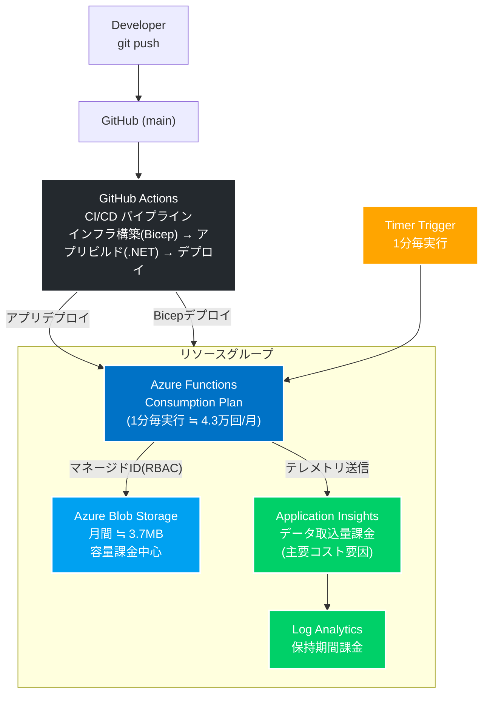
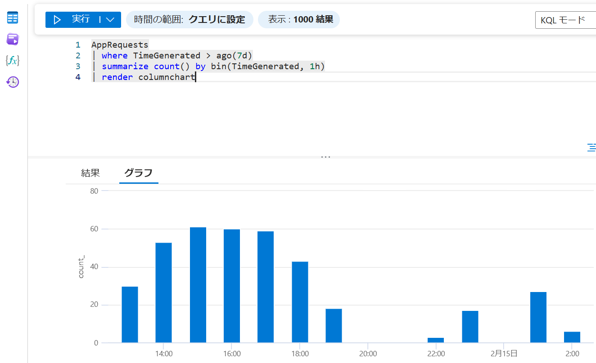

# Azure上のログ生成基盤構築と運用設計の検証

## 1. プロジェクト概要

本プロジェクトは、**「ログ出力設計と監視コストは切り離せない」という前提に立ち、**
**再現性・最小権限・従量課金モデルを同時に満たすログ基盤の設計妥当性を検証したもの**です。

実務において、障害調査や運用改善を経験する中で、
**ログは出して終わりではなく、監視設計・コスト構造まで含めて設計対象である**と感じたことが出発点です。

実務における運用改善の経験を踏まえ、単に**動作するサーバーレス構成**を作るのではなく、
運用を前提とした設計思想がどこまで小規模構成で再現できるかをテーマとしています。

### 1-1：背景と課題

実運用では以下のような課題が発生しがちと考えます。

* 接続文字列に依存した設計によるセキュリティリスク
* 手作業構築による環境差異と再現性の欠如
* 監視ログの増加に伴う想定外のコスト増大
* ログ保存設計と監視設計が分離していることによる部分最適

特に、監視基盤のコストは「実行回数」よりも「データ取込量」に依存します。
そのため、ログ出力設計と監視設計を同時に考慮しなければ、将来的にコスト増大や可観測性の欠如につながります。

本検証では、ログ発生量と監視コストの関係を定量的に確認し、
設計思想が実際に機能するかを検証しました。

本プロジェクトでは、

* マネージドIDによる最小権限設計
* Bicepによる再現可能なIaC
* Consumption Planによる従量課金モデル
* KQLによる実行推移の可視化

を組み合わせ、小規模構成の中で設計思想の妥当性を検証しています。
また、Timer Trigger による定期実行を行うことで、ログ発生量とコスト構造の関係を定量的に確認できる構成としています。

### 1-2：採用技術と設計方針

* **Azure Functions (.NET 8 Isolated / Consumption Plan)**

  * Timer Trigger による 1分毎の定期実行（約43,200回/月）
  * 従量課金モデルを採用し、動いていないときはコストを発生させない構成

* **Blob Storage へのログ出力**

  * 1ログあたり約86B（実測値）
  * 月間約3.7MB程度のデータ量
  * DBではなく低コストなオブジェクトストレージを採用

* **Application Insights / Log Analytics による監視**

  * ログの収集
  * 将来的なコスト増加要因は「データ取込量」であることを意識
  * Blobよりも監視ログの増加が課金の根本になる設計

* **IaC (Bicep) による再現可能な環境構築**

  * 環境差異・手順作業の最小化

* **最小権限の RBAC 設計**

  * マネージドID + ロール割り当て によるアクセス制御
  * 運用負荷とセキュリティリスクの低減

* **GitHub Actions によるフルオートメーション (CI/CD)**
  * `main` ブランチへのPUSHを起点とし、**「インフラ構築(Bicep) → アプリビルド(.NET) → デプロイ」**を自動化
  * Bicepの静的解析（Linter）を組み込み、構文ミス等をデプロイ前に検知する仕組みを構築

---

## 2. 構成図

※ 想定トラフィックでは無料枠内で運用可能だが、ログ増加時はApplication Insightsのデータ取込量が主なコスト増要因となる

---

## 3. 開発の過程
### 3-1：ローカル開発環境の構築

#### 3-1-1. 背景/やったこと

* .NET 8 Isolated モデルへの移行に伴い、VS Code上でローカル開発環境を構築
* VS Codeで直接クラウド上の検証用ストレージに接続し、リモートデバッグを実行
* ネットワークの遅延やRBAC反映の遅延など、実際のAzure環境で起こる挙動を体験

#### 3-1-2. 問題

* 従来の In-Process モデル用デバッグ設定では関数が認識されず、初回接続時にエラー
* デバッグできず、処理の検証が困難

#### 3-1-3. 解決策

* `tasks.json` のビルドターゲットを Isolated モデル向けに修正
* `launch.json` の `preLaunchTask` と整合性を調整

#### 3-1-4. 結果

* 初期段階から本番環境に近い状態での動作検証を体験
* ローカル → クラウドに移行した時のギャップを最小化

#### 3-1-5. 学び

* ローカルで確実に動作確認できないコードは、クラウドでも動かない
* 実際に開発する際のリスクを最初の段階で痛感

### 3-2：Azure プロトタイプ構築

#### 3-2-1. 背景/やったこと

* リソースグループ `RG-Portfolio-Automation` に、Azure Portalから関数アプリとストレージを作成
* 接続文字列による接続でプロトタイプを実装

#### 3-2-2. 問題

* 接続文字列の中身を直接コードに書くとセキュリティ上のリスク
* GUI操作のみでは再現性が低く、原因特定が困難

#### 3-2-3. 解決策

* 「とりあえず動く状態」を作った後、以下を検討

  * 3-3：マネージドIDへの移行
  * 3-4：IaC（Bicep）への移行（再現できるところはしたいという動機）

#### 3-2-4. 結果

* プロトタイプとして動作を確認
* 課題が明確になり、3.解決策に記載の通り設計方針の改善を決定

#### 3-2-5. 学び

* GUIだけでの環境構築では再現性・セキュリティが不十分
* 「動くこと」に加えて「安全に再現できること」の両立が必要

### 3-3：マネージドIDへの移行

#### 3-3-1. 背景/やったこと

* Function にシステム割り当てマネージドIDを付与
* Azure.Identity ライブラリの DefaultAzureCredential を採用し、アプリケーションコード（C#）内から ストレージ接続文字列を排除

#### 3-3-2. 問題

* ID付与だけではストレージにアクセスできず、何度やっても認証エラー（403 Forbidden）が発生
* RBAC の存在や権限反映のタイムラグでトラブル

#### 3-3-3. 解決策

* 必要な権限（ストレージBLOBデータ共同作成者）を特定
* 最小権限原則に基づき、IDを指定して権限を付与

#### 3-3-4. 結果

* マネージドIDにより Blob への読み書きは可能（ただし関数実行用のストレージ接続は必要）
* Function App の展開や Run From Package には AzureWebJobsStorage が必須であるため、完全なパスワードレスではない

#### 3-3-5. 学び

* Function App 展開用ストレージは AzureWebJobsStorage が必須
* RBAC の正しい理解なしではパスワードレス化は不可能
* Azure の権限設計と最小権限原則を実務で体感

### 3-4：IaC (Bicep) への移行

#### 3-4-1. 背景/やったこと

* Azure Portalからのリソース作成（手動）をやめ、Bicep ファイルで全体を管理
* Timer Trigger + Blob アクセス、App Insights、Log Analytics をコード化

#### 3-4-2. 問題

* デプロイ後に Timer Trigger が動作せず、関数が登録されない
* 原因は環境変数 `FUNCTIONS_EXTENSION_VERSION` と `FUNCTIONS_WORKER_RUNTIME` の指定漏れ
* RBACロールID指定ミスや listKeys 警告など Bicepのエラーに遭遇

#### 3-4-3. 解決策

* 必須環境変数を明示的に追加

  * `FUNCTIONS_EXTENSION_VERSION = '~4'`
  * `FUNCTIONS_WORKER_RUNTIME = 'dotnet-isolated'`
* subscriptionResourceId を指定したセキュアなロール指定

#### 3-4-4. 結果

* 再現可能なセキュアなインフラ環境を構築
* Timer Trigger + Blobへのアクセスが安定稼働

#### 3-4-5. 学び

* 小さな設定ミスで全体が停止することを痛感
* ドキュメント参照と再現テストによる自力トラブルシュートの難しさを痛感
* IaC + RBAC + Managed Identity の統合しての運用の必要性を痛感

### 3-5：BicepリファクタリングとCI/CD実装

#### 3-5-1. 背景/やったこと

* GitHub Actionsを利用したCI/CDパイプラインにおいて、インフラ（Bicep）とアプリケーション（.NET 8）の一括デプロイを実行
* Bicepコード内のストレージ接続文字列の取得ロジックを見直し、よりセキュアになるようリファクタリングを実施

#### 3-5-2. 問題

* `listKeys` の使用により `use-resource-symbol-reference` 警告が出て、GitHub Actionsがエラーとして検知しデプロイが中断
* 権限付与（RBAC）とアプリの設定更新が同時に走り、「DeploymentActive」エラーによるデプロイの渋滞が発生

#### 3-5-3. 解決策

* `listKeys` をリソース名から直接呼び出す形式に変更し、警告を解消
* 複雑な接続文字列の生成ロジックを `var` に切り出し、`appSettings` には完成した変数のみを渡す構造に改善

#### 3-5-4. 結果

* GitHub Actionsが正常に完了
* 実行順序が担保されたことで、リソースの競合エラーが発生しないインフラ構成を構築

#### 3-5-5. 学び

* 同じロジックでも、記述する場所によってツールの評価が変わるというBicepの思考を理解
* 複雑な設定を詰め込むのではなく、変数を活用して設定箇所をシンプルに保つことでデプロイのエラーが少なくなると理解
* デプロイ時に「Failed to perform sync trigger」が発生した場合、リソースが停止状態（Stopped）でないかを確認

### 3-6：KQLによる監視

#### 3-6-1. 背景/やったこと
* Log Analytics ワークスペースに集約された `AppRequests` ログを対象に、KQLを用いたクエリ分析を実施
* 1時間単位でのログ集計を行い、関数の実行推移をグラフ化

#### 3-6-2. 問題
* Application InsightsとLog Analyticsではテーブル構造が異なり、標準的なカラム名（operation_Name等）ではエラーが発生
* 範囲を指定しない数値データのみでは、特定の時間帯の負荷や実行の成否を直感的に判断することが困難

#### 3-6-3. 解決策
* `TimeGenerated` や `AppRoleName` を用いたLAW専用のクエリへ最適化
* `bin(TimeGenerated, 1h)` を用いて、ログを1時間単位で取得
* `render columnchart` を活用し、文字データを分かりやすいグラフへ変換

1時間単位のログ集計グラフ

#### 3-6-4. 結果
* 任意の期間の実行回数グラフを生成し、負荷状況を判断できるよう実装
* 複雑なログ群から必要な情報を抽出し、グラフとして出力する一連の手法を実装

#### 3-6-5. 学び
* デプロイの成功はしたものの、KQLによる継続的な監視があって初めてシステムの完成・運用につながっていくと理解
* ツール（LAWとAppInsights）ごとの微妙な仕様差を受け入れ、適切なクエリを選択する適応力の重要性を実感

---

## 4. 本プロジェクトで得られた設計視点

本プロジェクトを通じて、以下の観点を実践的に理解しました。

* ログ出力は単なる独立した機能ではなく、コスト構造を含めた設計対象である
* IaCとRBACを両方考慮して初めて再現性とセキュリティが成立する
* CI/CDでは構文エラーだけでなく依存関係や実行順序も設計対象となる
* 監視設計は実装後ではなく、設計段階から考慮すべきである

小規模な構成であっても、設計思想を明確にし検証することで、実運用を見据えた基盤設計の基礎を構築できると考えています。